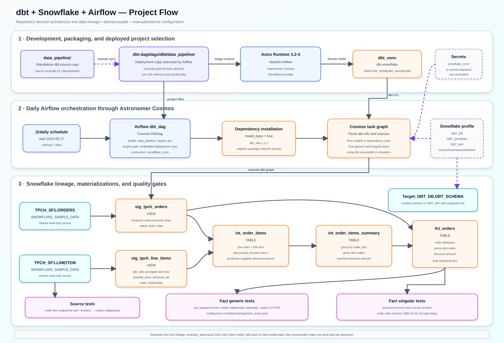

# dbt + Snowflake + Airflow

This repository demonstrates a daily analytics pipeline built with dbt, Snowflake, Apache Airflow, Astronomer Cosmos, and the Astro Runtime. Airflow uses Cosmos to convert a dbt dependency graph into Airflow tasks. The dbt project reads Snowflake's shared TPCH sample data, builds staging views and mart tables in a separate database/schema, and runs source, generic, and singular quality tests.

## Architecture

[Download the PNG flowchart](docs/project-flowchart.png) · [Full-size SVG](docs/project-flowchart.svg) · [Editable Mermaid source](docs/project-flowchart.mmd)



## What the project does

1. The `dbt-dag` Astro project builds an Astro Runtime 3.2-4 image.
2. Its Dockerfile creates `dbt_venv` and installs the Snowflake dbt adapter inside that virtual environment.
3. The Astro Python requirements install Astronomer Cosmos and the Airflow Snowflake provider.
4. Every day, the Airflow `dbt_dag` uses Cosmos to load the embedded dbt project at `dbt-dag/dags/dbt/data_pipeline`.
5. Cosmos maps the Airflow connection `snowflake_conn` to the dbt profile `data_pipeline`, target `dev`, with output database `dbt_db` and schema `dbt_schema`.
6. The DAG installs the pinned `dbt_utils` package and executes dbt models/tests according to their source and `ref()` dependencies.
7. The dbt project reads `SNOWFLAKE_SAMPLE_DATA.TPCH_SF1.ORDERS` and `LINEITEM`, producing:
   - two staging views;
   - two intermediate mart tables; and
   - a final `fct_orders` fact table.
8. dbt tests validate source keys and relationships, final fact keys/statuses, discount signs, and order dates.

The active `example_astronauts` DAG is a separate Astro tutorial. It calls the Open Notify API, falls back to hard-coded astronaut data if the request fails, and uses dynamic task mapping to print one message per astronaut. It does not interact with Snowflake or dbt.

## Data lineage

```text
SNOWFLAKE_SAMPLE_DATA.TPCH_SF1.ORDERS
    └─> stg_tpch_orders (view) ─┬─> int_order_items (table)
                               │       └─> int_order_items_summary (table)
                               │                └─> fct_orders (table)
                               └────────────────────> fct_orders (table)

SNOWFLAKE_SAMPLE_DATA.TPCH_SF1.LINEITEM
    └─> stg_tpch_line_items (view) ─> int_order_items
```

### Models

| Model | Materialization | Purpose |
|---|---|---|
| `stg_tpch_orders` | View | Renames order/customer keys and selects status, price, and date. |
| `stg_tpch_line_items` | View | Creates a surrogate order-item key with `dbt_utils` and selects line-level measures. |
| `int_order_items` | Table | Joins orders to line items and calculates the discount amount through a custom macro. |
| `int_order_items_summary` | Table | Aggregates gross item sales and discount amount by order. |
| `fct_orders` | Table | Combines order attributes with the order-item summary for analytics. |

All models are created in the configured target schema, normally `DBT_DB.DBT_SCHEMA`. Staging models inherit `view`; everything under `models/marts` inherits `table` from `dbt_project.yml`.

The `discounted_amount` macro intentionally returns a negative decimal value:

```sql
(-1 * extended_price * discount_percentage)::decimal(16, 2)
```

### Tests

| Scope | Test | Expected condition |
|---|---|---|
| Source `orders` | `unique`, `not_null` | `o_orderkey` is populated and unique. |
| Source `lineitem` | `relationships` | Every `l_orderkey` exists in source `orders`. |
| `fct_orders.order_key` | `unique`, `not_null` | Final fact grain remains one row per order. |
| `fct_orders.order_key` | `relationships`, warning severity | Every final order exists in `stg_tpch_orders`; failures warn rather than fail. |
| `fct_orders.status_code` | `accepted_values` | Status is `P`, `O`, or `F`. |
| `fct_orders` | singular discount test | No `item_discount_amount` is positive. |
| `fct_orders` | singular date test | Order date is between 1990-01-01 and the current date. |

## Repository layout

```text
.
├── data_pipeline/                     # Standalone dbt development copy
│   ├── dbt_project.yml
│   ├── packages.yml                   # dbt_utils 1.1.1
│   ├── macros/pricing.sql
│   ├── models/
│   │   ├── staging/                   # TPCH sources and staging views
│   │   └── marts/                     # Intermediate and final tables/tests
│   └── tests/                         # Singular fact tests
├── dbt-dag/                           # Astro project root
│   ├── .astro/config.yaml
│   ├── Dockerfile
│   ├── requirements.txt
│   ├── dags/
│   │   ├── dbt_dag.py                 # Cosmos DbtDag definition
│   │   ├── exampledag.py              # Independent tutorial DAG
│   │   └── dbt/data_pipeline/         # dbt copy actually used by Airflow
│   └── tests/dags/test_dag_example.py
├── docs/                              # Architecture diagrams
└── logs/dbt.log                       # Tracked local dbt command log
```

## Required configuration

### 1. Local prerequisites

Install:

- Docker Desktop or another Docker daemon
- Astronomer CLI (`astro`)
- A Snowflake account
- Optional: Python and `dbt-snowflake` for running the standalone dbt project outside Airflow

The Astro project root is `dbt-dag`, not the repository root.

### 2. Snowflake objects and permissions

The checked-in configuration expects these names:

| Object | Configured name | Where referenced |
|---|---|---|
| Source database | `SNOWFLAKE_SAMPLE_DATA` | `tpch_sources.yml` |
| Source schema | `TPCH_SF1` | `tpch_sources.yml` |
| Output database | `DBT_DB` | Cosmos profile arguments |
| Output schema | `DBT_SCHEMA` | Cosmos profile arguments |
| Warehouse | `DBT_WH` | `dbt_project.yml` |
| Recommended role | `DBT_ROLE` | Configure in the Airflow connection |

Create or replace the output objects to match your Snowflake environment. A representative administrator-run setup is:

```sql
CREATE WAREHOUSE IF NOT EXISTS DBT_WH
  WAREHOUSE_SIZE = 'XSMALL'
  AUTO_SUSPEND = 60
  AUTO_RESUME = TRUE;

CREATE DATABASE IF NOT EXISTS DBT_DB;
CREATE SCHEMA IF NOT EXISTS DBT_DB.DBT_SCHEMA;
CREATE ROLE IF NOT EXISTS DBT_ROLE;

GRANT USAGE ON WAREHOUSE DBT_WH TO ROLE DBT_ROLE;
GRANT USAGE ON DATABASE DBT_DB TO ROLE DBT_ROLE;
GRANT USAGE ON SCHEMA DBT_DB.DBT_SCHEMA TO ROLE DBT_ROLE;
GRANT CREATE TABLE, CREATE VIEW ON SCHEMA DBT_DB.DBT_SCHEMA TO ROLE DBT_ROLE;
GRANT IMPORTED PRIVILEGES ON DATABASE SNOWFLAKE_SAMPLE_DATA TO ROLE DBT_ROLE;

GRANT ROLE DBT_ROLE TO USER YOUR_DBT_USER;
```

Use an existing warehouse/database/schema/role instead if appropriate, and update both copies of the dbt project plus `dbt_dag.py` consistently. The Snowflake user must be able to use the warehouse, read the shared sample database, and create/replace views and tables in the target schema.

If `SNOWFLAKE_SAMPLE_DATA` is unavailable in your account, import the Snowflake sample share or change `models/staging/tpch_sources.yml` to a database/schema containing compatible `ORDERS` and `LINEITEM` tables.

### 3. Airflow Snowflake connection

Create an Airflow connection with the exact ID `snowflake_conn`:

| Field | Required value |
|---|---|
| Connection ID | `snowflake_conn` |
| Connection type | Snowflake |
| Account | Your Snowflake account identifier, including region/cloud details when required by your account format |
| Login | Snowflake service user |
| Password | Service-user password |
| Warehouse | `DBT_WH` |
| Database | `DBT_DB` |
| Schema | `DBT_SCHEMA` |
| Role | `DBT_ROLE` or another role with the grants above |

`SnowflakeUserPasswordProfileMapping` is explicitly used in `dbt_dag.py`, so the current code expects password authentication. To use key-pair or OAuth authentication, select and configure the corresponding Cosmos profile mapping rather than merely changing connection fields.

For local development, add the connection through the Airflow UI after `astro dev start`, or create a local `dbt-dag/airflow_settings.yaml`. That file is ignored by Git and is suitable for local-only connection settings. For deployed environments, use the platform's secrets backend or environment-based Airflow connection secret. Never commit Snowflake credentials.

### 4. Standalone dbt profile

The source project under `data_pipeline/` uses profile name `data_pipeline`. Running dbt directly requires a local `~/.dbt/profiles.yml`, for example:

```yaml
data_pipeline:
  target: dev
  outputs:
    dev:
      type: snowflake
      account: "{{ env_var('SNOWFLAKE_ACCOUNT') }}"
      user: "{{ env_var('SNOWFLAKE_USER') }}"
      password: "{{ env_var('SNOWFLAKE_PASSWORD') }}"
      role: DBT_ROLE
      database: DBT_DB
      warehouse: DBT_WH
      schema: DBT_SCHEMA
      threads: 4
```

Set `SNOWFLAKE_ACCOUNT`, `SNOWFLAKE_USER`, and `SNOWFLAKE_PASSWORD` in your shell or secret manager. A committed `profiles.yml` is intentionally not required.

### 5. Keep the two dbt projects synchronized

There are two complete copies:

- `data_pipeline/` for standalone development;
- `dbt-dag/dags/dbt/data_pipeline/`, which is the path referenced by the Airflow DAG.

They were verified as byte-for-byte identical during this review. Editing only `data_pipeline/` does not change what Airflow runs. Until the project is refactored to use a single canonical copy or an automated build-time copy, mirror every dbt change into `dbt-dag/dags/dbt/data_pipeline/` and review both paths before committing.

### 6. Package and network access

`packages.yml` pins `dbt_utils` to `1.1.1`. The Airflow DAG sets `install_deps=True`, so the runtime may need outbound network access to retrieve dbt packages. The example astronaut DAG separately needs HTTP access to `api.open-notify.org`, although it has a hard-coded fallback.

The Docker build needs access to the Astro Runtime image registry and Python package indexes to install `dbt-snowflake`.

## Run the standalone dbt project

Always run dbt commands from the directory containing `dbt_project.yml`:

```bash
cd data_pipeline
dbt deps
dbt debug
dbt build
```

To inspect the generated dbt documentation:

```bash
dbt docs generate
dbt docs serve
```

The tracked `logs/dbt.log` records earlier `dbt deps` failures caused by running the command from the repository root, where no `dbt_project.yml` exists. Changing into `data_pipeline` resolves that path error.

## Run with Airflow and Astro

From the repository root:

```bash
cd dbt-dag
astro dev start
```

Then:

1. Open <http://localhost:8080>.
2. Add and test `snowflake_conn` if it was not loaded through local settings.
3. Confirm that `dbt_dag` imports and its Cosmos-generated task graph is visible.
4. Trigger `dbt_dag` manually for the first run.
5. Inspect mapped model/test task logs and verify the five output models in Snowflake.

Useful Astro commands:

```bash
astro dev ps
astro dev logs --scheduler
astro dev pytest
astro dev stop
```

The production dbt DAG is scheduled daily, starts from 2023-05-17, and has `catchup=False`, so it does not automatically backfill all historical intervals.

## Validation checklist

- [ ] Docker and Astronomer CLI are installed and working.
- [ ] `DBT_WH`, `DBT_DB`, and `DBT_SCHEMA` exist.
- [ ] The dbt role can read `SNOWFLAKE_SAMPLE_DATA.TPCH_SF1`.
- [ ] The dbt role can create tables/views in `DBT_DB.DBT_SCHEMA`.
- [ ] Airflow contains a valid `snowflake_conn`.
- [ ] `AIRFLOW_HOME/dbt_venv/bin/dbt` exists inside the Astro containers.
- [ ] Both copies of the dbt project contain the same changes.
- [ ] `dbt deps`, `dbt debug`, and `dbt build` pass from `data_pipeline/`.
- [ ] `astro dev pytest` and DAG parsing pass.
- [ ] The Airflow `dbt_dag` run succeeds.
- [ ] Both staging views and all three mart tables exist in Snowflake.
- [ ] Generic and singular dbt tests complete with expected severities.

## Known limitations and review findings

- **The dbt project is duplicated.** Airflow runs the embedded copy, not the root `data_pipeline/` copy. Manual synchronization can easily produce deployment drift.
- **The provided DAG policy test does not match `dbt_dag`.** `test_dag_example.py` requires every DAG to have tags and at least two retries. `dbt_dag.py` currently defines neither tags nor `default_args["retries"]`, so the policy test will fail once the DAG imports successfully.
- **Earlier dbt commands used the wrong working directory.** `logs/dbt.log` shows `dbt deps` looking for a root-level `dbt_project.yml`. Run it from `data_pipeline/` or pass `--project-dir`.
- **The local dbt log is committed.** `logs/dbt.log` is tracked even though generated logs generally belong in `.gitignore`; it may reveal usernames, local paths, adapter versions, and command history.
- **Most Python dependencies are not pinned.** The Astro base image is versioned, but `astronomer-cosmos`, `apache-airflow-providers-snowflake`, and `dbt-snowflake` have no explicit versions. Future rebuilds can resolve different dependency combinations.
- **Dependencies are installed at runtime.** `install_deps=True` adds network reliance and latency to DAG processing/execution. Consider resolving packages during the image build or committing a build artifact after testing.
- **Every model is rebuilt daily.** Staging views and mart tables are not incremental. This is reasonable for TPCH SF1 but may become expensive with larger sources.
- **No source freshness checks exist.** Tests validate shape and relationships but do not detect stale source data.
- **The example DAG is active.** It adds an unrelated daily external API call and extra tasks. Remove or disable it if this repository should contain only the Snowflake pipeline.
- **Connection behavior is tied to password authentication.** Key-pair and OAuth authentication require a different Cosmos mapping and appropriate provider configuration.
- **The Snowflake names are hard-coded in multiple places.** Database, schema, and warehouse changes must be kept consistent between `dbt_dag.py`, both `dbt_project.yml` files, source YAML, and connection settings.

## Security and production notes

- Do not commit Snowflake passwords, private keys, OAuth secrets, or an `airflow_settings.yaml` containing credentials.
- Use a dedicated service identity and least-privilege Snowflake role rather than a personal user or `ACCOUNTADMIN` at runtime.
- Configure Airflow's secrets backend for deployed environments and rotate any credential that has appeared in Git history.
- Pin and regularly test Python/dbt/Cosmos dependency versions.
- Define retry behavior, failure notifications, ownership, and tags on the production DAG.
- Add CI checks for `dbt deps`, parsing/compilation, SQL linting, project-copy drift, and Astro DAG integrity.
